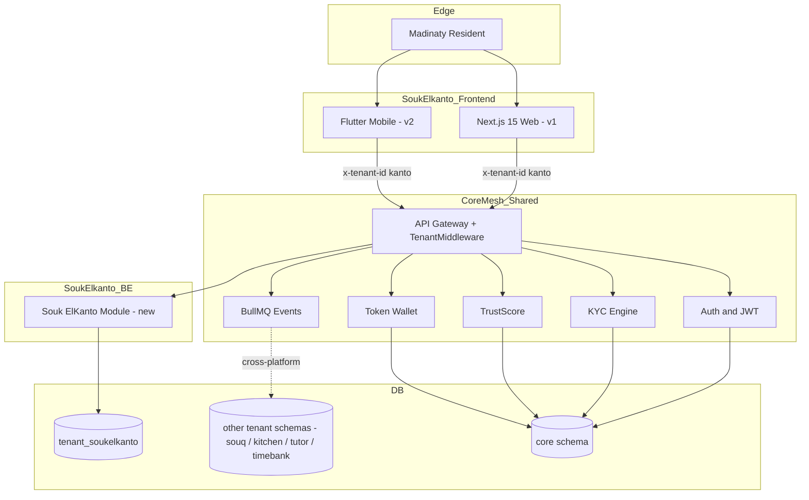
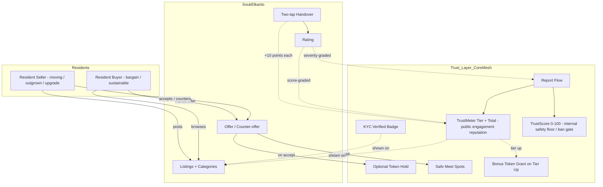
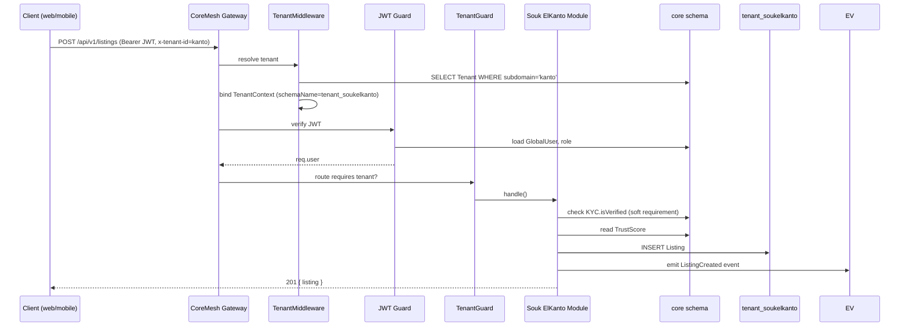
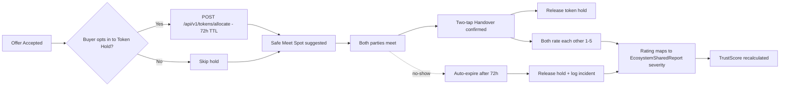
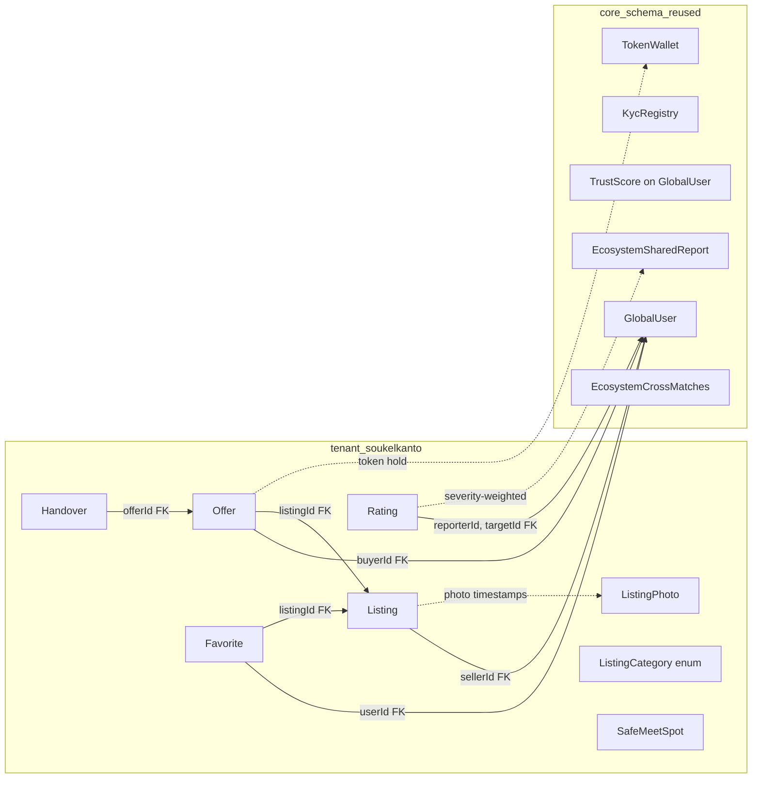

# Souk ElKanto — Architecture (Business + Technical)

> Tenant under MadinatyAI Ecosystem Hub (CoreMesh).
> Last updated: 2026-06-01

---

## 1. Where Souk ElKanto Sits in the Ecosystem

Souk ElKanto is **a tenant**, not a new platform. It plugs into the existing CoreMesh gateway via subdomain `kanto.madinatyai.com` and PostgreSQL schema `tenant_soukelkanto`.



---

## 2. Business Architecture

### 2.1 Stakeholders and Value Flows



### 2.2 Value Proposition Canvas (compressed)

| Resident pain (today) | Souk ElKanto solution |
|-----------------------|------------------------|
| Scattered Facebook groups / WhatsApp | One curated marketplace inside Madinaty |
| Anonymous strangers | KYC-verified neighbors only |
| No reputation signal | Portable **TrustMeter** tier + points (public) + TrustScore (safety floor, internal) — both from CoreMesh |
| No reason to behave well | Bonus token grants on tier upgrades — rewards repeat good citizenship |
| Stolen photos / fake listings | Server-side photo timestamping |
| Random meetup spots = safety risk | Designated Safe Meet Spots inside city |
| No-show buyers / sellers | Optional commitment token hold |
| Disputes have no recourse | Report flow → TrustScore penalty AND TrustMeter point deduction |

### 2.3 Revenue Model (v1 → v3)

| Phase | Mechanism | Source |
|-------|-----------|--------|
| v1 | Free — pure trust-building | (no direct revenue) |
| v2 | Featured listings | Individual tokens (closed-loop) |
| v2 | Boost in category | Individual tokens |
| v3 | Power-seller verification badge | Business tokens (subscription) |
| v3 | Cross-tenant analytics for retailers | Business tokens |

**Broker stance kept throughout:** all "revenue" is closed-loop token consumption, never cash on platform.

---

## 3. Technical Architecture

### 3.1 Module Layout (inside CoreMesh monorepo)

```
CoreMesh/
├── apps/core-hub/src/modules/
│   └── soukelkanto/                  ← NEW
│       ├── soukelkanto.module.ts
│       ├── listings/
│       │   ├── listings.controller.ts
│       │   ├── listings.service.ts
│       │   └── dto/
│       ├── offers/
│       │   ├── offers.controller.ts
│       │   ├── offers.service.ts
│       │   └── dto/
│       ├── handover/
│       │   ├── handover.controller.ts
│       │   └── handover.service.ts
│       ├── categories/
│       │   └── categories.controller.ts
│       └── safe-spots/
│           └── safe-spots.controller.ts
├── libs/                              (no new libs — reuses everything)
└── prisma/schema.prisma               ← tenant_soukelkanto block added
```

### 3.2 Request Lifecycle



### 3.3 Lightweight Protection — Flow Detail



### 3.4 Data Plane



### 3.5 AI Usage (Hybrid via CoreMesh AI Router)

| Use case | Complexity | Provider |
|----------|-----------|----------|
| Listing description spam / abuse moderation | LOW | Ollama llama3:8b |
| Auto-categorization suggestion from title + photo | LOW | Ollama llama3:8b |
| Duplicate / re-used photo detection | LOW | Ollama llama3:8b (image hash compare) |
| "Suggest fair price" from category + condition + photos | HIGH | Gemini 1.5 Pro |
| Semantic search (buyer query → similar listings) | HIGH | Gemini embeddings → pgvector |
| Cross-tenant recommendations (saw on Souq → suggest on Kanto) | HIGH | pgvector similarity |

### 3.6 Events Emitted

| Event | Trigger | Consumed by |
|-------|---------|----------|
| `souk.listing.created` | Seller posts a listing | Analytics ledger, semantic indexer |
| `souk.listing.unlisted.under24h` | Seller removes a listing < 24h after posting | TrustMeter listener (-2 pts) |
| `souk.listing.expired` | Listing reaches 90 days with no offer accepted | TrustMeter listener (-1 pt) |
| `souk.listing.sold.within30d` | Listing transitions to SOLD < 30 days after posting | TrustMeter listener (+5 pts seller) |
| `souk.offer.accepted` | Seller accepts an offer | Token-hold scheduler, notification |
| `souk.offer.noshow` | 72h after `ACCEPTED` with no handover confirm | TrustMeter listener (-8 pts buyer or seller as applicable) |
| `souk.handover.confirmed` | Both parties tap confirm | TrustScore recalc, rating prompt, **TrustMeter listener (+10 pts each)** |
| `souk.rating.received` | A user receives a rating | TrustScore (via report), **TrustMeter listener (score-mapped delta)** |
| `souk.report.verified` | Admin verifies a report against a user | TrustScore recalc (existing), **TrustMeter listener (severity-mapped negative)** |

All routed through CoreMesh BullMQ → `EcosystemCrossMatches` + new `@madinatyai/trust-meter` event consumer. See `CoreMesh/docs/trust-meter.md` §5.6 for the event-to-action mapping.

### 3.7 TrustMeter Integration

Souk ElKanto is a **producer** of TrustMeter signals. It emits domain events through BullMQ; the `@madinatyai/trust-meter` library's event listener (lives in CoreMesh core) translates them into `TrustMeterEvent` ledger rows and updates the user's running total.

**The Souk ElKanto module never calls TrustMeter APIs directly to write.** It only:

1. **Emits domain events** (see §3.6 list).
2. **Reads** the public `GET /api/v1/trust-meter/users/:userId` endpoint to display tier + total on listings, offers, and profile screens.

This separation keeps Souk ElKanto decoupled from TrustMeter internals — if point values change in admin config, no Souk code changes.

**Display contract for Souk ElKanto:** Every place that today shows TrustScore (listing detail, offer modal, profile) now ALSO shows TrustMeter tier + total. TrustScore stays internal (only used to block sub-20 users from listing creation per `PRD §1.5`). TrustMeter is the user-visible badge.

---

## 4. Tenant Provisioning Checklist (CoreMesh side)

- [ ] Add `kanto` row to `Tenant` table (`subdomain=kanto`, `tier=STANDARD`, `isActive=true`).
- [ ] Add `'soukelkanto': 'tenant_soukelkanto'` to `TENANT_SCHEMA_MAP`.
- [ ] Add `tenant_soukelkanto` block to `prisma/schema.prisma`.
- [ ] Run `prisma db push` to materialize the schema.
- [ ] Add `kanto.madinatyai.com` DNS A-record / Vercel domain alias.
- [ ] Seed initial `ListingCategory` enum values.
- [ ] Seed Safe Meet Spots (lat/lng for ~10 designated locations).
- [ ] Seed `ActivityPricing` for `kanto_listing_boost_7d` (token wallet).

---

## 5. Out of Scope for v1 (kept here so they don't sneak in)

- Auctions / timed bidding.
- In-app messaging beyond offer notes (use WhatsApp deep link from `GlobalUser.metadata.whatsapp`).
- Delivery / shipping logistics.
- Payment processing of any kind.
- Multi-currency or international shipping.
- Merchant tier / pro stalls.
- Native mobile app (web responsive first).
