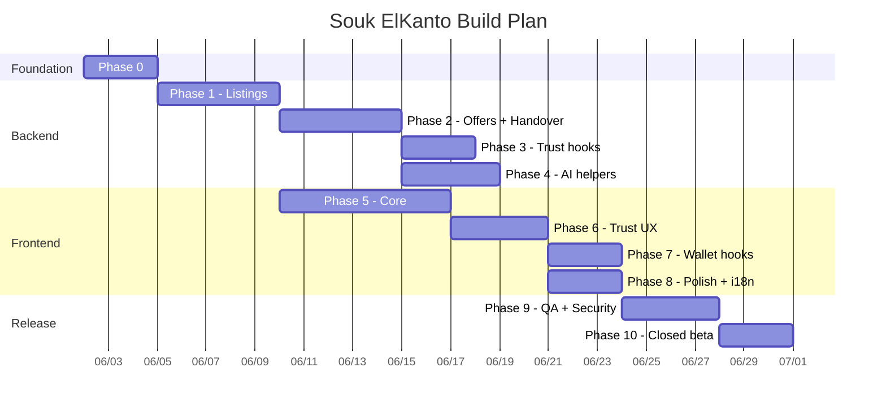

# Souk ElKanto — Technical Implementation Plan

> Step-by-step plan for AI agents (Claude Code / human devs).
> Parallel + sequential phases. Stack rationale included.

---

## 0. Stack Decision Tree

All decisions below align with `CLAUDE.md` invariants — **no deviation**.

| Layer | Choice | Rationale |
|-------|--------|-----------|
| Backend module location | New NestJS module inside existing `CoreMesh/apps/core-hub/src/modules/soukelkanto/` | Reuses tenant middleware, KYC, TrustScore, Wallet, AI Router, Events — zero new infra |
| ORM | Prisma 5.22 (existing) | Already configured with `multiSchema` + pgvector |
| Schema | New `tenant_soukelkanto` block in `prisma/schema.prisma` | Schema-per-tenant invariant |
| Auth | CoreMesh JWT (existing) | One identity across all tenants |
| Frontend v1 | Next.js 15 (App Router, Turbopack) + React 19 + TS strict | Matches `Platform/` exactly — design tokens reusable |
| Frontend hosting | Vercel | Same as Platform |
| Image storage | Cloudflare R2 (S3-compatible) via `@aws-sdk/client-s3` | Cheap egress vs S3; presigned URLs for direct browser upload |
| Search | Postgres full-text + pgvector for semantic | Avoids Elasticsearch overhead at this scale |
| Maps (Safe Meet Spots) | Leaflet + react-leaflet (already in Platform) | Consistent with Platform map panel |
| State management | Server Components + URL state + small Zustand store for cart/favorites | Avoid overengineering |
| Forms | React Hook Form + Zod | Type-safe DTO mirroring NestJS class-validator |
| Tests (BE) | Jest 29 + Supertest (existing CoreMesh stack) | Consistent |
| Tests (FE) | Vitest + React Testing Library + Playwright (e2e) | Matches global rules |
| Mobile (v2) | Flutter 3.x + Riverpod + go_router | Per global rules |

---

## 1. Phases at a Glance

```
Phase 0 — Foundation                  [Sequential — 3 days]
Phase 1 — Backend: Listings           [Sequential — 5 days]
Phase 2 — Backend: Offers + Handover  [Sequential — 5 days]
Phase 3 — Backend: Trust hooks        [Parallel with Phase 4 — 3 days]
Phase 4 — Backend: AI helpers         [Parallel with Phase 3 — 4 days]
Phase 5 — Frontend: Core              [Sequential — 7 days]
Phase 6 — Frontend: Trust UX          [Sequential — 4 days]
Phase 7 — Frontend: Wallet hooks      [Parallel with Phase 8 — 3 days]
Phase 8 — Frontend: Polish + i18n     [Parallel with Phase 7 — 3 days]
Phase 9 — QA, e2e, security review    [Sequential — 4 days]
Phase 10 — Closed beta launch         [Sequential — 3 days]

TOTAL: ~40 dev-days · ~8 weeks at part-time pace
```

---

## 2. Phase 0 — Foundation (Sequential, 3 days)

**Goal:** Tenant provisioned, schema deployed, scaffolding in place.

### 2.1 CoreMesh provisioning
- [ ] Insert `Tenant` row: `{subdomain: 'kanto', tierLevel: 'STANDARD', isActive: true}`.
- [ ] Update `libs/tenancy/src/tenant-resolver.ts` constant `TENANT_SCHEMA_MAP` to include `kanto: 'tenant_soukelkanto'`.
- [ ] Add `tenant_soukelkanto` to `prisma/schema.prisma` (see `data_model.md`).
- [ ] Run `npx prisma db push` (or migration if you prefer).
- [ ] Run `npx prisma generate`.
- [ ] Add unit test `libs/tenancy/src/tenant-resolver.spec.ts` covering `kanto → tenant_soukelkanto`.

### 2.2 Scaffold the NestJS module
- [ ] Create `apps/core-hub/src/modules/soukelkanto/`:
  - `soukelkanto.module.ts`
  - `listings/`, `offers/`, `handover/`, `categories/`, `safe-spots/`, `favorites/`, `ratings/`
- [ ] Wire `SoukelkantoModule` into `app.module.ts` imports.
- [ ] Add `@UseGuards(JwtAuthGuard, TenantGuard)` at module level.
- [ ] Add `e2e` spec scaffold: `apps/core-hub/test/soukelkanto.e2e-spec.ts`.

### 2.3 Frontend scaffold (Next.js sub-route)
- [ ] In `Platform/src/app/`, create `kanto/` route group OR decide on separate Next.js app.
  - **Decision:** Separate app at `SoukElkanto/web/` so it can be deployed independently. Shared design tokens via npm workspace.
- [ ] Initialize: `cd SoukElkanto/web && npx create-next-app@latest . --typescript --app --turbopack --no-tailwind --no-src-dir=false`.
- [ ] Copy design tokens from `Platform/src/app/globals.css` and align with `design_spec.md`.
- [ ] Configure `next.config.ts` rewrites: `/api/* → ${CORE_MESH_URL}/api/*` with `x-tenant-id: kanto` header injection middleware.

### 2.4 Repo layout

```
SoukElkanto/
├── docs/                          ← already created
├── web/                           ← Next.js 15 app (v1 frontend)
│   ├── src/
│   │   ├── app/
│   │   ├── components/
│   │   ├── lib/
│   │   ├── data/
│   │   └── types/
│   ├── public/
│   ├── package.json
│   └── ...
├── mobile/                        ← Flutter app (v2 — leave empty for now)
└── README.md
```

### Acceptance
- `curl -H "x-tenant-id: kanto" -H "Authorization: Bearer <jwt>" http://localhost:3000/api/v1/tenant/context` returns `{schemaName: "tenant_soukelkanto", ...}`.
- `npx jest --ci` still passes 25/25 unit + 5/5 e2e in CoreMesh.

---

## 3. Phase 1 — Backend: Listings (Sequential, 5 days)

**Goal:** Sellers can CRUD listings; buyers can search.

### 3.1 DTOs and validation (Day 1)
- [ ] `dto/create-listing.dto.ts` — class-validator: `title (3-120)`, `description (10-2000)`, `category (enum)`, `condition (enum)`, `askingPrice (int > 0)`, `currency='EGP'`, `photos (min 1, max 8)`, `district`.
- [ ] `dto/update-listing.dto.ts` — partial.
- [ ] `dto/list-listings.dto.ts` — pagination, filters.

### 3.2 Service + repository (Day 2-3)
- [ ] `listings.service.ts`:
  - `create(userId, dto)` → check TrustScore > 20, generate `photoTimestamps`, INSERT into `Listing`.
  - `findAll(filters)` → paginated; default sort = `createdAt DESC`.
  - `findOne(id)` → joins seller summary (KYC verified bool, TrustScore, district, member-since).
  - `update(userId, id, dto)` → owner-only.
  - `delete(userId, id)` → soft-delete (status=`REMOVED`).
  - `search(query)` → Postgres full-text on `title + description`.

### 3.3 Photo upload via presigned URL (Day 3-4)
- [ ] `listings.controller.ts` adds `POST /listings/photo-upload-url` returning Cloudflare R2 presigned PUT URL.
- [ ] On listing create, client passes back the R2 keys. Server validates each key exists in R2 (HEAD request).
- [ ] Server-side photo timestamp recorded in `ListingPhoto.uploadedAt` (server time, not client claim).
- [ ] If EXIF date > 30 days old, flag `isPhotoStale = true` (warning, not block).

### 3.4 Moderation hook (Day 4)
- [ ] On create, call `aiRouter.moderate(title + description)` (LOW complexity). If returns `flagged=true`, auto-set `status=PENDING_REVIEW`.

### 3.5 Tests (Day 5)
- [ ] Unit: `listings.service.spec.ts` — happy + error paths for all 6 methods.
- [ ] e2e: `listings.e2e-spec.ts` — create / list / get / update / delete with tenant context.
- [ ] All tests pass; coverage ≥ 70% for service.

### Acceptance
- `POST /api/v1/listings` with valid DTO returns 201 + listing.
- Listing without photos returns 400.
- User with TrustScore ≤ 20 gets 403.
- Search `?q=stroller` returns matching listings.

---

## 4. Phase 2 — Backend: Offers + Handover (Sequential, 5 days)

**Goal:** Full offer lifecycle from "make offer" to "rated".

### 4.1 Offer state machine

```
PENDING ── seller accepts ──> ACCEPTED ── handover both-tap ──> CONFIRMED ── 24h ──> CLOSED
   │                              │                                          │
   │                              └── 72h no handover ──> EXPIRED            │
   │                                                                          │
   └── seller declines ──> DECLINED                                    rating cycle
   │
   └── buyer withdraws ──> WITHDRAWN
   │
   └── seller counters ──> COUNTERED ──> (back to PENDING with new price)
```

### 4.2 Implementation (Day 1-3)
- [ ] `offers.service.ts` — `make(buyerId, listingId, dto)`, `accept(sellerId, offerId)`, `decline`, `counter`, `withdraw`.
- [ ] On `accept`:
  - Mark offer `ACCEPTED`.
  - Set listing `status = RESERVED`.
  - Suggest nearest Safe Meet Spot (Haversine on stored seller district).
  - Emit `souk.offer.accepted` event.
  - If buyer opted for token hold → `tokensService.allocate(buyerId, 'souk_buyer_hold', 'individual', holdAmount, ttl=72h)`.

### 4.3 Handover (Day 3-4)
- [ ] `handover.service.ts`:
  - `confirm(userId, offerId)` — records tap with timestamp.
  - When both buyer + seller tapped → state = `CONFIRMED`.
  - Release token hold.
  - Mark listing `SOLD`.
  - Open rating window (24h).

### 4.4 Rating (Day 4-5)
- [ ] `ratings.service.ts`:
  - `rate(userId, offerId, score 1-5, comment?)` — both parties can call once.
  - Map score → `EcosystemSharedReport` severity:
    - 5 → severity 0 (positive)
    - 4 → severity 0 (positive)
    - 3 → severity 1 (mild concern)
    - 2 → severity 3 (moderate)
    - 1 → severity 5 (severe)
  - Insert into `EcosystemSharedReport` (core schema).
  - Trigger TrustScore recalc on target user.

### 4.5 Tests
- [ ] Unit for offer state transitions (all valid + invalid moves).
- [ ] Unit for handover both-tap convergence.
- [ ] Unit for rating-to-severity mapping.
- [ ] e2e: full happy path `make → accept → confirm × 2 → rate × 2`.

---

## 5. Phase 3 — Backend: Trust hooks (Parallel with Phase 4, 4 days)

### 5.1 TrustScore (existing — safety floor only)
- [ ] `POST /api/v1/listings/:id/report` — wraps existing `ReportsController.create()`, adds `originSubdomain='kanto'`, `subjectType='listing' | 'user'`.
- [ ] Implement TrustScore threshold guard on `create-listing`: throw `ForbiddenException` (`INSUFFICIENT_TRUST`) if score ≤ 20.
- [ ] TrustScore is **NOT** displayed to users — internal ban-gate only.

### 5.2 TrustMeter (new — public engagement reputation)
- [ ] On listing view, eagerly load seller's `TrustMeter { total, tier, tierReachedAt, highestTotal }` from CoreMesh `/api/v1/trust-meter/users/:userId`. Cache 5 min via Redis (CoreMesh handles this — Souk just calls the cached endpoint).
- [ ] Emit `souk.handover.confirmed` event when `SoukHandover.bothConfirmedAt` is set. Payload: `{ offerId, listingId, buyerId, sellerId, confirmedAt }`.
- [ ] Emit `souk.rating.received` event from `RatingsService.rate`. Payload: `{ offerId, raterId, targetId, score }`.
- [ ] Emit `souk.listing.sold.within30d` event in `ListingsService` when status transitions to SOLD and `now - listing.createdAt < 30 days`.
- [ ] Emit `souk.listing.unlisted.under24h` event in `ListingsService.delete` when `now - listing.createdAt < 24h`.
- [ ] Emit `souk.listing.expired` event via cron when a listing reaches 90 days with no accepted offer.
- [ ] Emit `souk.offer.noshow` event from token-hold expiration handler when hold auto-releases without handover.
- [ ] Emit `souk.report.verified` event when an admin marks a report as verified.
- [ ] **No direct TrustMeter writes** — only emit events. The `@madinatyai/trust-meter` listener in CoreMesh handles updates.
- [ ] Unit tests: every emit-point is covered with mock event-bus assertion.
- [ ] Frontend acceptance: every listing card + listing detail + offer modal + dashboard renders `TrustMeterBadge`.

---

## 6. Phase 4 — Backend: AI helpers (Parallel with Phase 3, 4 days)

### 6.1 Category suggestion
- [ ] `POST /api/v1/ai/suggest-category` → AiRouter LOW (Ollama) — input: title + first photo URL → returns top 3 category enums with confidence.

### 6.2 Price suggestion
- [ ] `POST /api/v1/ai/suggest-price` → AiRouter HIGH (Gemini) — input: title + category + condition + photo URLs + district → returns suggested EGP range based on recent comparable listings (uses pgvector similarity).

### 6.3 Semantic search
- [ ] On listing publish, generate 768-d embedding via Gemini `text-embedding-004` → store in `Listing.embedding` (pgvector column).
- [ ] `GET /api/v1/listings/search?q=...&semantic=true` → embed query → cosine similarity in pgvector.

### 6.4 Duplicate-photo detection
- [ ] On photo upload, compute perceptual hash (pHash via `sharp`) → store in `ListingPhoto.phash`.
- [ ] On new upload, compare against last 30 days of phashes; if match ≥ 95%, flag.

---

## 7. Phase 5 — Frontend: Core (Sequential, 7 days)

### 7.1 Routes
- [ ] `/` — home, hero + category grid + featured listings.
- [ ] `/listings` — paginated grid with filters (sidebar / drawer).
- [ ] `/listings/[id]` — listing detail (carousel, trust panel, offer CTA).
- [ ] `/listings/new` — create listing wizard (4 steps: photos → details → price → review).
- [ ] `/my/listings` — seller dashboard.
- [ ] `/my/offers` — sent + received offers.
- [ ] `/my/handovers` — pending + completed.
- [ ] `/categories/[slug]` — category landing.

### 7.2 Components
- [ ] `ListingCard`, `ListingDetail`, `TrustPanel`, `PhotoUploader` (R2 presigned), `CategoryGrid`, `OfferModal`, `HandoverConfirm`, `RatingStars`, `SafeMeetSpotMap`, `CategoryFilter`, `PriceRangeFilter`.

### 7.3 API client
- [ ] `lib/api/client.ts` — fetch wrapper injecting JWT + `x-tenant-id: kanto`.
- [ ] `lib/api/listings.ts`, `lib/api/offers.ts`, etc — typed clients.
- [ ] React Query for caching + invalidation.

### Acceptance
- All 8 routes render on mobile + desktop.
- Listing detail loads in < 1.5s (LCP).
- Offer flow round-trips without page reload.

---

## 8. Phase 6 — Frontend: Trust UX (Sequential, 5 days)

- [ ] `TrustMeterBadge` component (xs / sm / md sizes) — tier leaf icon + tier label + total. Consumes `/api/v1/trust-meter/users/:userId` cached response.
- [ ] `TrustPanel` component visible on every listing detail + offer screen — KYC badge, `TrustMeterBadge` (md), tier-progress bar, member-since.
- [ ] `TrustMeterMeter` full visualization on `/my/trust-meter` tab.
- [ ] `TrustMeterActivityFeed` paginated event list on `/my/trust-meter` tab.
- [ ] `TierUpgradeToast` global listener — subscribes to SSE / polling from `/api/v1/trust-meter/me` for tier changes, fires celebratory toast.
- [ ] Photo timestamp warning if `isPhotoStale`.
- [ ] Safe Meet Spot suggestion modal post-offer-accepted with map view.
- [ ] Report modal (severity 1-5 select + reason text + optional photo evidence).
- [ ] Rating modal post-handover (1-5 stars + comment).
- [ ] Empty/error states use friendly Arabic and English copy.
- [ ] "How TrustMeter works" info modal (bilingual) accessible from any TrustMeterBadge with a tiny info icon.

---

## 9. Phase 7 — Frontend: Wallet hooks (Parallel with Phase 8, 3 days)

- [ ] Token-hold opt-in UI on offer-accepted screen — slider for hold amount + 72h timer countdown after lock.
- [ ] Wallet sidebar (slide-in) showing current individual + business token balances (fetched from CoreMesh `/api/tokens/wallet`).
- [ ] Boost-listing CTA (v2 feature — gated behind feature flag in v1, visible-but-disabled).

---

## 10. Phase 8 — Frontend: Polish + i18n (Parallel with Phase 7, 3 days)

- [ ] Bilingual content in `src/data/content.ts` (`contentEn` + `contentAr` + type `SiteContent`).
- [ ] AR default route `/ar/*`; English at `/en/*`. `/` redirects to `/ar`.
- [ ] RTL layout pass — logical CSS properties, mirror icons.
- [ ] Skeleton loaders for listing grid, detail, dashboard.
- [ ] Accessibility audit (axe-core) — focus traps in modals, aria labels on interactive icons.
- [ ] OG meta tags + JSON-LD product schema for SEO.

---

## 11. Phase 9 — QA, e2e, security review (Sequential, 4 days)

- [ ] Playwright e2e suite covering:
  - Anon user → register → KYC submit → list listings.
  - Seller posts listing with photos → buyer makes offer → handover → both rate.
  - Bad actor flow: post NSFW photo → auto-flagged → admin reviews.
  - Token-hold flow: lock → auto-expire → confirm balance restored.
- [ ] Security review checklist:
  - JWT validation on every endpoint.
  - Tenant context required on every tenant route.
  - Owner-only checks on update/delete listings.
  - Input validation strict (no `forbidNonWhitelisted: false`).
  - Rate limiting on offer creation (max 30/hour per buyer).
  - R2 presigned URLs scoped to 5 min and single-use.
  - Photo MIME type sniffing server-side (not just extension).
- [ ] Run `npm audit` (FE) and `pip-audit` equivalent (BE: `npm audit` on CoreMesh) — zero high/critical.

---

## 12. Phase 10 — Closed beta launch (Sequential, 3 days)

- [ ] DNS: `kanto.madinatyai.com` → Vercel project.
- [ ] Add to platform NavBar: "كانتو" link.
- [ ] Seed 100 beta users via admin token grants (50 individual tokens each).
- [ ] Set up Sentry / monitoring on both BE and FE.
- [ ] Day 1: 25 beta users.
- [ ] Day 2: 50 more.
- [ ] Day 3: open to first 100 — read feedback in `#kanto-beta` channel.
- [ ] Post-beta retrospective doc.

---

## 13. Parallelization Map



---

## 14. Dependencies Risk Register

| Dependency | Owned by | Failure mode | Mitigation |
|------------|----------|--------------|-----------|
| CoreMesh KYC working | CoreMesh team | Without KYC, no verified badge | Phase 1 ships without strict gate — soft requirement |
| Token Wallet API stable | CoreMesh team | Hold mechanism breaks | Wallet integration in Phase 7 — late, gives buffer |
| **TrustMeter library `@madinatyai/trust-meter`** | CoreMesh team | No TrustMeter display, no tier upgrades, no bonus grants | Souk ElKanto v1 ships with placeholder "New Seller" chip if TrustMeter unavailable. Frontend gracefully degrades when `/api/v1/trust-meter/users/:userId` returns 404 or 503. |
| **TrustMeter event listener** | CoreMesh team | Events emitted but not processed | Souk events stay queued in BullMQ — replay-safe via idempotency keys. |
| Cloudflare R2 account | DevOps | Upload broken | S3 fallback (drop-in compatible) |
| Gemini API quota | Vendor | AI suggestion features degrade | Already gated to HIGH-only; Ollama fallback for category suggestion |
| Vercel deployment | DevOps | FE down | Vercel SLA + Cloudflare cache |

---

## 15. Definition of Done (v1 release)

- All 10 phases complete.
- All BE tests pass: unit + e2e + 0 lint errors + 0 TS errors.
- All FE: `typecheck` + `build` + Playwright e2e green.
- 100 closed-beta users onboarded.
- ≥ 30 listings created in beta week.
- ≥ 5 handovers completed end-to-end.
- 0 P0/P1 bugs open.
- `npm audit` clean.
- Updated entries in:
  - Root `CLAUDE.md` (mention `tenant_soukelkanto` in TENANT_SCHEMA_MAP rule)
  - `Documents/Ecosystem_Architecture.md` (add Souk ElKanto to high-level diagram)
